<!-- CABEÇALHO ANIMADO (ondas se movimentando) -->

<!-- BEM-VINDO ANIMADO (texto sendo digitado) -->

  

<!-- TERMINAL ANIMADO (arquivo próprio do repositório) -->

 

<h2 align="center">👋 Sobre mim</h2>

  Estudante de Análise e Desenvolvimento de Sistemas (ADS).

 

<h2 align="center">⚡ Tecnologias</h2>

  
  

  
  

 

<h2 align="center">📂 Meus projetos</h2>

<table align="center">
  <tr>
    <td align="center" width="360">
      <h3>📁 Safe-Track</h3>
      
<em>Projeto em desenvolvimento.</em>

      <a href="https://github.com/anes3103/Safe-Track">🔗 Ver repositório</a>
    </td>

    <td align="center" width="360">
      <h3>📁 Água-Alerta</h3>
      
<em>Projeto em desenvolvimento.</em>

      <a href="https://github.com/anes3103/Agua-Alerta">🔗 Ver repositório</a>
    </td>
  </tr>
</table>

 

<h2 align="center">🐍 Minha atividade no GitHub</h2>

  <picture>
    <source media="(prefers-color-scheme: dark)" srcset="https://raw.githubusercontent.com/anes3103/anes3103/output/github-snake-dark.svg" />
    <source media="(prefers-color-scheme: light)" srcset="https://raw.githubusercontent.com/anes3103/anes3103/output/github-snake.svg" />
    
  </picture>

 

<h2 align="center">📊 Estatísticas</h2>

  

